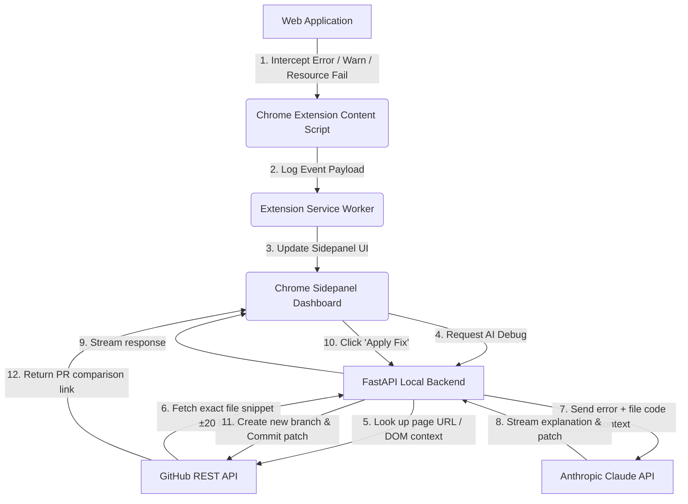

# 🐛 Dev-Helper V2

A proactive **Inspect Element** alternative powered by local AI. Dev-Helper V2 runs as a seamless Chrome Side Panel that intercepts runtime errors, network failures, and console logs, queries Anthropic Claude with full file-level code context from your connected GitHub repository, and applies automated hotfixes directly to a new branch on GitHub in a single click.

---

## 📺 Video Preview & Demo

Have a look at Dev-Helper V2 in action! The preview below demonstrates error interception on a buggy dashboard, real-time AI debugging, and applying an automated git patch directly to GitHub:

<video src="Recording 2026-05-17 202345.mp4" width="100%" controls autoplay loop muted style="border-radius: 8px; box-shadow: 0 4px 20px rgba(0, 0, 0, 0.35); margin: 16px 0;"></video>

> [!TIP]
> **GitHub Repository Hosting Note:** 
> Keeping large video files in your repository can lead to repository bloat. For the best GitHub experience, you can upload your `.mp4` file directly to a GitHub Issue or Pull Request comment field to generate a hosted CDN link, then replace the local path in this README with the generated `https://github.com/user-attachments/assets/...` URL!

---

## 🌟 Key Features

*   **🔍 Proactive Inspect Alternative**: Captures uncaught JavaScript errors, unhandled promise rejections, network errors (`fetch` / `XHR`), console warnings, and broken DOM resource links automatically.
*   **🤖 Context-Aware AI Debugging**: Leverages Anthropic Claude to analyze errors. If a GitHub repo is connected, it automatically retrieves file context and lines ±20 around the error for high-fidelity debugging.
*   **🚀 One-Click GitHub Hotfixes**: Applies the suggested fix directly by creating a custom branch (`devhelper/fix-...`) and committing the patched file on your behalf. Instantly provides a link to open a PR!
*   **📊 Live Performance Profiling**: Visualizes critical metrics in real-time, including DOMContentLoaded time, full page load time, active resource counts, and JS Heap memory usage.
*   **🕓 Local SQLite History**: Saves previous analysis reports, Claude's detailed explanations, and recommended fixes in a local SQLite database (`dev_helper.db`) for retrospective review.
*   **🎭 Sleek Premium Dark UI**: Engineered with modern CSS variables, vibrant status glows, clean loading animations, and responsiveness.

---

## 🛠️ System Architecture & Workflow

Here is how the proactive debugging and automated patching pipeline operates under the hood:



---

## 📂 Project Structure

```text
dev-helper/
├── backend/
│   ├── main.py              # FastAPI server, GitHub helper & Claude integration
│   └── requirements.txt     # Python dependencies
├── extension/
│   ├── manifest.json        # Extension Manifest V3 configuration
│   ├── background.js        # Background worker for tab state management
│   ├── content.js           # Content script injecting inject.js
│   ├── inject.js            # Intercepts console, errors, network, & resources
│   ├── sidepanel.html       # Sidepanel layout
│   ├── sidepanel.js         # Sidepanel controller, OAuth, and API handler
│   └── sidepanel.css        # Premium Dark Sidepanel styles
├── dummy/                   # A broken dashboard app specifically to test features
│   ├── index.html           
│   ├── app.js               
│   └── style.css            
├── .gitignore               # Ignored secrets & database files
├── dev_helper.db            # Local SQLite database (Auto-created, Git ignored)
└── README.md                # Project documentation
```

---

## 🚀 Installation & Setup

### 1. Backend Server Setup
The local backend is built using FastAPI. Ensure you have Python 3.9+ installed.

1. Navigate to the backend folder:
   ```bash
   cd backend
   ```
2. Create and activate a virtual environment:
   ```bash
   python -m venv venv
   # On Windows (PowerShell):
   .\venv\Scripts\Activate.ps1
   # On macOS/Linux:
   source venv/bin/activate
   ```
3. Install dependencies:
   ```bash
   pip install -r requirements.txt
   ```
4. Create a `.env` file in the root directory (`dev-helper/.env`) and add your Anthropic API Key:
   ```env
   ANTHROPIC_API_KEY=your-sk-ant-api-key-here
   CLAUDE_MODEL=claude-opus-4-6
   ```
5. Run the server:
   ```bash
   python main.py
   ```
   The backend will start on `http://localhost:8000`.

### 2. Chrome Extension Setup
1. Open Google Chrome and navigate to `chrome://extensions/`.
2. Enable **Developer mode** (toggle in the top-right corner).
3. Click **Load unpacked** in the top-left corner.
4. Select the `extension` folder inside this project directory.
5. Pin **Dev-Helper V2** to your extensions toolbar.

---

## 💻 Running the Test Application (BuggyDash)

To test the full capability of the extension, we've included **BuggyDash**, a deliberately broken dashboard.

1. Open `dummy/index.html` directly in your browser, or serve it using a local HTTP server:
   ```bash
   # Using Node.js
   npx serve dummy
   # Or using Python
   python -m http.server -d dummy 5500
   ```
2. Click the Dev-Helper extension icon in your toolbar to slide open the side panel dashboard.
3. Paste a **GitHub Personal Access Token (PAT)** (ensure permissions `repo` and `workflow` are checked) and connect your repository: `SuDy0906/dev-helper`.
4. Trigger errors on the BuggyDash dashboard:
   *   **Load User**: Triggers a JavaScript TypeError.
   *   **Fetch Stats**: Triggers a 404 network request failure.
   *   **Process Payment**: Triggers an unhandled promise rejection.
   *   **Load Notifications**: Triggers warnings and console errors.
   *   **Broken Image**: Triggers a DOM resource load error.
5. Click **🤖 Debug with AI** on any captured issue inside the Sidepanel to watch Claude analyze your actual repository files and suggest code fixes.
6. Click **Apply Fix on GitHub** to push the fix to your remote repo instantly!

---

## 🧰 Tech Stack

| Component | Technology | Description |
| :--- | :--- | :--- |
| **Frontend UI** | HTML5, Vanilla CSS3 (Custom Variables), Vanilla JavaScript | Responsive layout, theme-aligned dark system, and CSS animations. |
| **Browser Integration** | Chrome Extensions Manifest V3, Scripting API, sidePanel API | Intercepts Web APIs, manipulates DOM, and handles sidebar presentation. |
| **Backend Framework**| FastAPI (Python) | High-performance async server for processing errors, SQLite interactions, and repository streaming. |
| **AI Integration** | Anthropic Python SDK (Claude) | Generates fast, accurate context-enriched code analysis and complete drop-in fixes. |
| **Database** | SQLite3 | Local storage of error history, resolutions, and system telemetry. |
